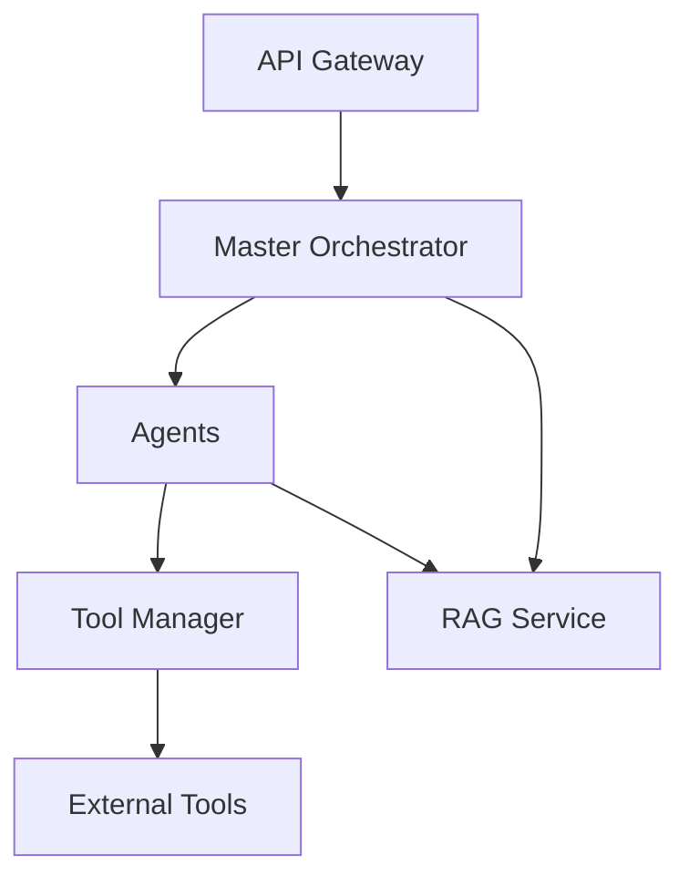

# System Architecture

## Overview

The Manis-Inspired Autonomous AI System implements a distributed multi-agent architecture with hierarchical orchestration. This document details the system's core architectural components and their interactions.

## Core Components

### 1. Master Orchestrator

The central coordination component responsible for:
- Goal decomposition using HybridPlanner
- Task assignment to appropriate agents
- Job and task status tracking
- Adaptive replanning based on agent feedback

### 2. Agent System

Agents are autonomous components that:
- Implement the `IAgent` interface from agent-template
- Process TaskAssignment messages
- Send StatusUpdate and CoTLog messages
- Execute specific capabilities

Current agent implementations:
- Echo Agent: Basic example agent
- Web Search Agent: Dual-mode implementation with Google Custom Search API and Playwright

### 3. Model Context Protocol (MCP)

Standardized communication protocol implemented using:
- Zod schemas for message validation
- RabbitMQ for message transport
- Defined message types:
  - TaskAssignment
  - StatusUpdate
  - CoTLog
  - AgentCapability

### 4. Tool Manager

Secure tool execution service that:
- Manages external tool access
- Implements security measures
- Provides standardized tool interfaces
- Handles error cases and retries

### 5. RAG Service

Memory and context management service featuring:
- Vector database integration
- Embedding generation
- Context retrieval
- Memory persistence

## Communication Flow

## Security Architecture

1. **Sandboxing**
   - Isolated execution environments
   - Resource limitations
   - Network restrictions

2. **Authentication & Authorization**
   - Service-to-service authentication
   - Capability-based access control
   - Token-based API security

3. **Data Security**
   - Input validation using Zod
   - Secure configuration management
   - Encrypted communication

## Observability

1. **Logging**
   - Structured logging with Pino
   - Context propagation
   - Log levels and sampling

2. **Metrics**
   - Performance metrics
   - System health indicators
   - Business metrics

3. **Tracing**
   - Distributed tracing
   - Request correlation
   - Performance analysis

## Scalability Considerations

1. **Horizontal Scaling**
   - Stateless services
   - Message queue-based communication
   - Container orchestration support

2. **Load Balancing**
   - Service discovery
   - Round-robin distribution
   - Health checks

3. **Data Management**
   - Caching strategies
   - Database sharding considerations
   - Message persistence

## Error Handling

1. **Retry Mechanisms**
   - Exponential backoff
   - Circuit breakers
   - Dead letter queues

2. **Failure Modes**
   - Graceful degradation
   - Fallback mechanisms
   - Error propagation

## Development Considerations

1. **Type Safety**
   - TypeScript throughout
   - Zod schema validation
   - Strict type checking

2. **Testing**
   - Unit tests
   - Integration tests
   - E2E testing

3. **Monitoring**
   - Health checks
   - Performance monitoring
   - Error tracking